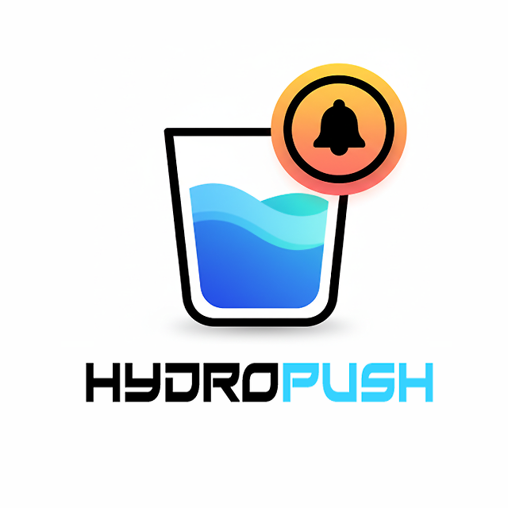

<div align="center">
  
  

  # 💧 Hydropush APP

  **Monitoramento Inteligente e Gamificado de Hidratação Diária**

  [](./LICENSE)
  [](#)
  [](#)
  [](#)
  [](#)

  *Hydropush é um aplicativo 100% Web (PWA), livre da burocracia das lojas de aplicativos, com interface premium e retenção de usuários focada em gamificação.*

</div>

---

## 📖 Índice

- [Visão Geral](#-visão-geral)
- [Arquitetura PWA Puro](#-arquitetura-pwa-puro)
- [Funcionalidades e Experiência do Usuário](#-funcionalidades-e-experiência-do-usuário)
- [Stack Tecnológica](#-stack-tecnológica)
- [Design System & Estética](#-design-system--estética)
- [Guia de Instalação e Desenvolvimento](#-guia-de-instalação-e-desenvolvimento)
- [Licença](#-licença)

---

## 🌊 Visão Geral

O **Hydropush** vai além de ser apenas um "contador de copos d'água". Ele foi construído para resolver o problema crônico de retenção em apps de saúde através de **Engajamento Gamificado (Estilo Duolingo)**, punindo a negligência e recompensando a consistência diária.

Em sua versão final, o Hydropush é um **Progressive Web App (PWA) puro**. Você acessa via URL, adiciona à tela inicial e ele se comporta exatamente como um aplicativo nativo (inclusive funcionando offline).

---

## 🏗️ Arquitetura PWA Puro

O projeto abandonou a estrutura complexa de pontes nativas e monorepos em favor da simplicidade e da velocidade de deploy. 

```text
HYDROPUSH-APP/
├── src/                      # Código fonte global (React + TypeScript)
│   ├── features/             # Módulos funcionais isolados
│   │   ├── auth/             # Onboarding e configuração inicial do usuário
│   │   ├── dashboard/        # Painel principal (Gráfico circular e registro rápido)
│   │   ├── history/          # Histórico detalhado de consumo
│   │   ├── profile/          # Status, avatar e gerenciamento de conquistas
│   │   └── stats/            # Analytics e projeções semanais/mensais
│   ├── core/                 # Núcleo da aplicação
│   │   └── services/         # Persistência de dados 100% LocalStorage
│   ├── shared/               # Componentes UI (Radix), hooks globais e Utils
│   └── styles/               # CSS global modularizado (Base, Tokens, Utilitários)
│
├── build/                    # Output otimizado gerado pelo Vite (Distribuído na Vercel)
│
├── vite.config.ts            # Configurações de Bundling
├── tailwind.config.js        # Definições do Design System
└── package.json              # Gerenciador de dependências Web
```

### Por que abandonamos o App Nativo?
1. **Zero Burocracia:** Sem Google Play ou App Store. Lançamentos e correções de bugs chegam aos usuários em segundos (Over-The-Air via Vercel).
2. **Código Ultra Leve:** Sem bibliotecas nativas, o bundle do aplicativo ficou minúsculo.
3. **Liberdade:** O PWA roda em iOS, Android, Windows e Mac a partir de um único código-fonte.

---

## ✨ Funcionalidades e Experiência do Usuário

- 💧 **Registro Fluido:** Adição de água (em ML) com apenas 1 clique através de atalhos rápidos.
- 🎯 **Meta Biométrica Inteligente:** O app calcula a ingestão ideal com base na regra clínica de `peso (kg) × 35ml`.
- 🎮 **Sistema de Retenção (Gamificação - Em Breve):**
  - **Vidas & Punição:** Se o usuário não atingir a meta, perde "vidas".
  - **Ofensivas (Streaks):** Manter a constância acumula dias de ofensiva.
- 🌙 **Temas Dinâmicos:** Suporte perfeito e em tempo real a Dark Mode e Light Mode.
- 📊 **Dashboard Analítico:** Visualização clara do progresso diário em anéis de preenchimento suave.

---

## 🛠️ Stack Tecnológica

O Hydropush é construído com as melhores ferramentas do ecossistema moderno do Front-end:

- **React 18.3:** Motor de renderização base.
- **TypeScript 5.7:** Tipagem estrita e segurança em tempo de compilação.
- **Vite 7.x:** Bundler ultrarrápido.
- **Tailwind CSS 4.x:** Estilização utilitária e customização profunda.
- **Framer Motion:** Micro-animações, transições de tela e fluidez de componentes.
- **Radix UI:** Acessibilidade e primitivas de UI sem estilo.
- **Recharts:** Gráficos interativos e responsivos.

---

## 🎨 Design System & Estética

O visual do Hydropush foi pensado para ser **Premium**. 
Baseado no conceito de *Liquid Glassmorphism*, a UI utiliza:

- **Translucidez e Blur:** Paineis flutuantes que se misturam ao fundo dinâmico.
- **Bottom Dock Adaptativo:** O menu de navegação inferior estilo iOS escala perfeitamente em desktops, mantendo a experiência mobile-first coerente.
- **Cores Terapêuticas:** Paletas desenhadas no modelo HSL para promover calma e fluidez, remetendo diretamente à água (Azul Água, Oceano, Menta, Lavanda).

---

## 🚀 Guia de Instalação e Desenvolvimento

### 1. Pré-requisitos
- **Node.js** 18 LTS ou superior
- **Git**

### 2. Rodando Localmente

```bash
# Clone o repositório
git clone https://github.com/cauan33xl/HYDROPUSH-APP.git

# Acesse a pasta
cd HYDROPUSH-APP

# Instale as dependências
npm install

# Inicie o servidor local
npm run dev
```
> Acesse: `http://localhost:5173`

### 3. Validação e Qualidade
O projeto adota o **ESLint Flat Config** (`eslint.config.js`) focado puramente nos diretórios de código-fonte (`src/`).
```bash
npm run lint
```

### 4. Gerando a Build de Produção
Para compilar o pacote Web otimizado:
```bash
npm run build
```
*(O diretório gerado `build/` é o que deve ser servido ou publicado na Vercel).*

---

## 📄 Licença

Este projeto é licenciado sob os termos da **GNU General Public License v3.0 (GPLv3)**.  
O uso, modificação e distribuição devem manter a natureza de código aberto.
Consulte o arquivo [LICENSE](./LICENSE) para informações completas.

<div align="center">
  <i>Desenvolvido com 🩵 por Cauan Gabriel Matos Silva (Cauan33XL) & Equipe Hydropush.</i>
</div>
